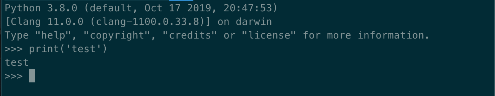

# Python解释器组件

## UI

模仿原始Python终端

制作组件库

Python终端组件由Item组件构成。
Item组件通过`Column`组件包装输入组件和输出组件。
输入组件通过`Row`组件包装输入提示">>>"（`Text`组件）和输入表单（`FormField`组件）。
输出组件为`Text`组件，无输出值时为空，有输出值时替换输出值。
input模式下更换输出组件为包含`FormField`的补充输入组件。

## UX

监听输入表单的输入确认"enter/return"，调用远端接口运行代码并接收返回值，在输出组件显示输出结果。

需要接收远端接口返回值的参数，如果是`true`则需要允许继续补充输入并继续监听，以应对输入`input`类代码的情况。
